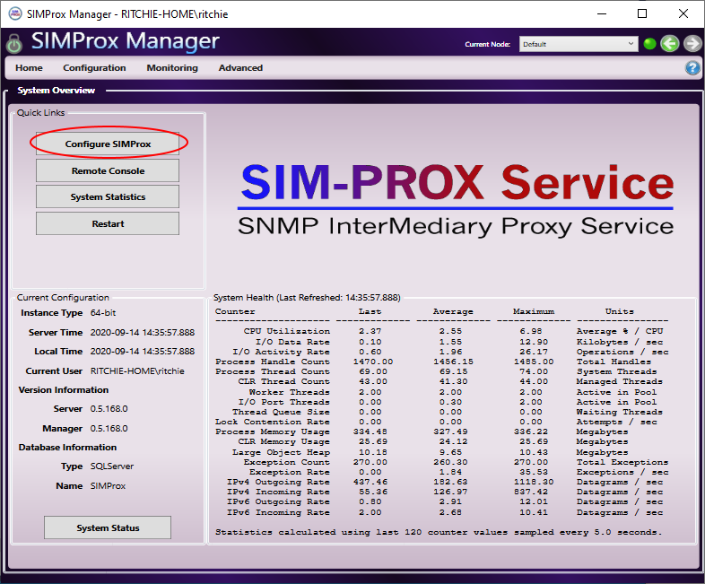
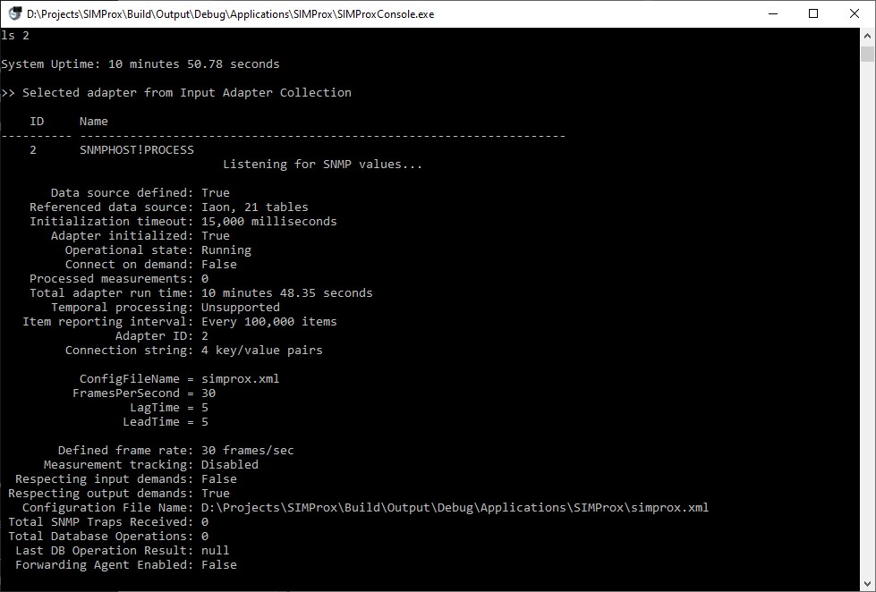

# About

SIMProx is a Windows service that provides a junction between SNMP V3 traps and database operations. The service can also act as a singleton forwarding proxy agent for SNMP messages from configured agent sources.


* [Discussions Forum](https://discussions.gridprotectionalliance.org/c/gpa-products/SNMP-Proxy-Service)
* [Requirements](#requirements)
* [Installation](#installation)
* [Configuration](#configuration)
* [Example Config File](#example-config-file)
* [Common Statistics](#common-statistics)

## Requirements
* 64-bit Windows 10 / Windows 2016 Server or newer.
* .NET 4.6 or later (currently .NET Framework deployments only).
* Database management system such as:
  * SQL Server (Recommended)
  * MySQL
  * Oracle
  * PostgreSQL
  * SQLite (Not recommended for large deployments) - included.

> Note that database is required for local configuration metadata, but can also be used as target for database operations. However target operations database and metadata database can be different.

## Installation

1) Download installer zip file `SIMProx.Installs.zip` from the [Releases](https://github.com/GridProtectionAlliance/SIMProx/releases) page.

2) Open zip file and double click on `SIMProxSetup.msi`.

3) Next through first page, accept [MIT license](https://github.com/GridProtectionAlliance/SIMProx/blob/master/LICENSE) on next page, and click next again.

4) On the `Custom Setup` page you can change the target install location if desired.

5) It is recommended to keep all production options listed on the `Custom Setup` page then click next.

6) On the `Service Account` page the default account for the SIMProx Windows service is `NT SERVICE\SIMProx`. Should you choose another user for the service, the user will at least need enough rights to host SNMP port on the local network interfaces, defaults to port `162`. Click next to continue.

7) On the `Company Information` page enter the company name that is hosting the SIMProx service and a short acronym, then click next.

8) Click install. When the installation completes, make sure "Launch Configuration Setup Utility" is checked and click finish.

9) The configuration setup utility for the service will now run. Click next from the first page.
> Note that the following steps assume this is a new installation, not an upgrade:

10) Select "I want to set up a new configuration." and click next.

11) Select "Database (suggested)" and click next.

12) On the `Set up a database` page, SQLite is the typical option. Once desired database is selected, click next.
> Note that the database is required for saving configuration information for the SIMProx service. When using database other than SQLite, see [additional configuration steps](https://github.com/GridProtectionAlliance/openHistorian/wiki/Using-the-Configuration-Setup-Utility#setting-up-a-new-configuration).

13) The `Set up a SQLite database` page defines the desired location for the SQLite database file, it defaults to the `ConfigurationCache` sub-folder of the SIMProx service installation folder. For non-default locations, service user will require read/write access. When the desired database location has been selected, click next.

14) On the `Define User Account Credentials` page, select the initial administrative user for the SIMProx service - installing user is the default. Click next when desired admin user has been selected. Additional users and groups can be configured later using the SIMProx Manager application.

15) Make sure "SIMProx Windows service" and "SIMProx Manager (local application)" are both checked and click next.

16) On the `Setup is ready` page, click next.

17) If the setup steps on the `Setup in progress` page succeed, click next.

18) Make sure "Start the SIMProx Service" and "Start the SIMProx Manager" are checked and click "Finish"

19) Installation is now complete, and the Windows SIMProx service will now be running.

20)  Continue with [Configuration](#configuration) steps below.

## Configuration

To change the default configuration of the SIMProx service, run the SIMProx Manager application, which can be found in the Windows start menu.
> If you are continuing directly from installation steps above, manager application will already by running.

When the application is running, click the `Configure SIMProx` button on the home page:



On the configuration screen, make sure `SNMPHOST!PROCESS` is selected in the adapter list at the bottom of the page. The the `Connection String` section arguments define the options to use for the `SNMP Proxy Host` adapter instance that actually performs the SNMP mapped database and agent forwarding operations.


The most important parameter here is the `ConfigFileName` setting that defines the local XML configuration for all the incoming SNMP sources and maps SNMP OIDs to database operations, see the [Example Config File](#example-config-file) below.

To enable _agent forwarding_ for all configured sources, find the `ForwardingEnabled` setting and set it to `true`. When this value is true, you should validate other forwarding settings as well -- these setting names will be prefixed with `Forward`.

Note that by default the target database for mapped database operations will be the locally configured database used to hold service configuration and metadata. To set the mapped target database operations to another database, change the values in the `DatabaseConnectionString` and `DatabaseProviderString` settings. Here are a few examples:

| Database&nbsp;Type | Example Database Connection String | Database Provider String |
| ------------------ | ------------------------- | --------------- |
| Sql Server | Data Source=serverName; Initial Catalog=databaseName; User ID=userName; Password=password | AssemblyName={System.Data, Version=4.0.0.0, Culture=neutral, PublicKeyToken=b77a5c561934e089}; ConnectionType=System.Data.SqlClient.SqlConnection; AdapterType=System.Data.SqlClient.SqlDataAdapter |
| MySQL| Server=serverName;Database=databaseName; Uid=root; Pwd=password; allow user variables = true; | AssemblyName={MySql.Data, Version=6.3.6.0, Culture=neutral, PublicKeyToken=c5687fc88969c44d}; ConnectionType=MySql.Data.MySqlClient.MySqlConnection; AdapterType=MySql.Data.MySqlClient.MySqlDataAdapter |
| Oracle |  Data Source=tnsName; User ID=schemaUserName; Password=schemaPassword | AssemblyName={Oracle.DataAccess, Version=2.112.2.0, Culture=neutral, PublicKeyToken=89b483f429c47342}; ConnectionType=Oracle.DataAccess.Client.OracleConnection; AdapterType=Oracle.DataAccess.Client.OracleDataAdapter |
| SQLite |  Data Source=databaseName.db; Version=3; Foreign Keys=True; FailIfMissing=True | AssemblyName={System.Data.SQLite, Version=1.0.109.0, Culture=neutral, PublicKeyToken=db937bc2d44ff139}; ConnectionType=System.Data.SQLite.SQLiteConnection; AdapterType=System.Data.SQLite.SQLiteDataAdapter |


Database operation expressions are configurable as SQL statements using the `DatabaseCommand` setting. You can set this value to something like `INSERT INTO StatusLog(Source,Type,Message) VALUES({0},{1},{2})` -- or -- for a database stored procedure, something like `sp_LogEvent`. You should also make sure the `DatabaseCommandTemplate` is defined properly for the parameters in the `DatabaseCommand` setting, e.g.: `'{Flow}',{EventType},'{Description}'`. Note that template values for the `DatabaseCommandTemplate` come directly from mappings in the primary XML configuration file as defined in the `ConfigFileName` setting, see the [Example Config File](#example-config-file) below.

The available `DatabaseCommandTemplate` parameter values are as follows:

| Template Parameter | Data Type | XML Mapping Attribute |
| :---------------------: | :-------: | ------------------ |
| `{EventType}` | Integer ([see values](https://github.com/GridProtectionAlliance/SIMProx/blob/master/Source/Applications/SIMProx/SIMProx/Config.cs#L37)) | state |
| `{Flow}` | String | flow |
| `{Description}` | String | description |

> Always click the `Save` button after making any changes as this operation updates the record in the configuration database.

### SIMProx Remote Console

A helpful application to use while configuring the `SNMP Proxy Host` adapter engine is the SIMProx Console application. Like the manager, this application can be found in the Windows start menu. Run this program now to continue with configuration steps:



From the console application you can type `list /a` (or `ls /a`) to show the available adapters.

For example, if the `SNMPHOST!PROCESS` adapter has an ID of 2, you can then enter `ls 2` (or `ls SNMPHOST!PROCESS`) to get detailed adapter status.

> If the console is noisy with status information you can enter the `quiet` command (or `q` for short) followed by enter to pause feedback, note that your keyboard input is being accepted even if it is interrupted by messages scrolling by, just keep typing. To restore normal status mode use the `resume` command (or `r` for short). Type `help` to see other available commands.

_For the next configuration step, it is helpful if the console is still visible to the side of the SIMProx Manager application so that both tools are visible at the same time._

#### Initializing SNMP Proxy Host

Make sure the SIMProx Manager application is open with the `SNMPHOST!PROCESS` adapter selected in the adapter list at the bottom of the page. Click the `Initialize` button and confirm the initialize action by clicking `Yes`. This operation will restart the `SNMP Proxy Host` adapter applying any updated argument settings and reloading any changes from the primary XML configuration file.

> Always make sure any changes are saved before initializing as the initialization process reads from the database configuration. Note that the adapter can also be reinitialized from the SIMProx Console application using the `initialize SNMPHOST!PROCESS` command.

If there are no error messages (typically in red), the `SNMP Proxy Host` should now be operational.

> Note that all feedback is logged locally to the `StatusLog.txt` file which can be found in the installation folder. The log file size is automatically curtailed per settings defined in the `SIMProx.exe.config` file. You can use the XML Configuration Editor, found in the SIMProx folder in the Windows start menu, to adjust any needed rarely changed configuration settings.

### Example Config File

SNMP sources and database operation mappings are managed through an XML file that maps SNMP OIDs to database operations based on a run-time evaluated conditions that use the received SNMP value, see example XML configuration file below.

> After making any changes to XML configuration, you will need to [Reinitialize SNMP Proxy Host](#initializing-snmp-proxy-host) for changes to take effect.

```xml
<?xml version="1.0" encoding="utf-8" ?>
<config xmlns:xsi="http://www.w3.org/2001/XMLSchema-instance" xmlns:xsd="http://www.w3.org/2001/XMLSchema">
  <!--
    GPA Root OID: 1.3.6.1.4.1.56056
      SNMP .1
        Statistics .1
          System       .1
          Device       .2
          InputStream  .3
          OutputStream .4
          Subscriber   .5
          Publisher    .6
          Process      .7
          Downloader   .8
            Signal Index .N (see common statistics below)
              Value .1
              Name  .2

    Note that system is currently configured to only respond to V3 SNMP traps.

    Flow states: Success, Warning, Alarm, Error, Information, Failover, Synchronize, Reschedule

    Note that mapped database operations use integer value from specified flow state based on following enumeration:
    https://github.com/GridProtectionAlliance/SIMProx/blob/master/Source/Applications/SIMProx/SIMProx/Config.cs#L37
  -->
  <source community="openMIC" authPhrase="pqgBG80CwgSDMKza" encryptKey="EjdEtEhHJCdLM04K" forward="true">
    <!-- Heartbeat Mappings -->
    <mapping oid="1.3.6.1.4.1.56056.1.1.1.1.1" flow="FL_OPENMIC_HEARTBEAT" description="openMIC heartbeat at {Timestamp}." state="Success" condition="true" />
    <!-- Info Mappings -->
    <mapping oid="1.3.6.1.4.1.56056.1.1.1.2.1" flow="FL_OPENMIC_CPU" description="openMIC using {Value}% CPU at {Timestamp}." state="Information" condition="true" />
    <mapping oid="1.3.6.1.4.1.56056.1.1.1.4.1" flow="FL_OPENMIC_MEMORY" description="openMIC using {Value} MB memory at {Timestamp}." state="Information" condition="true" />
    <mapping oid="1.3.6.1.4.1.56056.1.1.1.15.1" flow="FL_OPENMIC_UPTIME" description="openMIC uptime: {Value} seconds" state="Information" condition="true" />
    <!-- Warning Mappings -->
    <mapping oid="1.3.6.1.4.1.56056.1.1.1.2.1" flow="FL_OPENMIC_CPU" description="openMIC CPU exceeds 80%: {Value}% at {Timestamp}." state="Warning" condition="value > 80" />
    <mapping oid="1.3.6.1.4.1.56056.1.1.1.4.1" flow="FL_OPENMIC_MEMORY" description="openMIC memory exceeds 64GB: {Value}MB at {Timestamp}." state="Warning" condition="value > 64000" />
  </source>
  <source community="openMIC2" authPhrase="wgSDMKzapqgBG80C" encryptKey="JCdLM04KEjdEtEhH" forward="true">
    <!-- Heartbeat Mappings -->
    <mapping oid="1.3.6.1.4.1.56056.1.1.1.1.1" flow="FL_OPENMIC2_HEARTBEAT" description="openMIC2 heartbeat at {Timestamp}." state="Success" condition="true" />
    <!-- Info Mappings -->
    <mapping oid="1.3.6.1.4.1.56056.1.1.1.2.1" flow="FL_OPENMIC2_CPU" description="openMIC2 using {Value}% CPU at {Timestamp}." state="Information" condition="true" />
    <mapping oid="1.3.6.1.4.1.56056.1.1.1.4.1" flow="FL_OPENMIC2_MEMORY" description="openMIC2 using {Value} MB memory at {Timestamp}." state="Information" condition="true" />
    <mapping oid="1.3.6.1.4.1.56056.1.1.1.15.1" flow="FL_OPENMIC2_UPTIME" description="openMIC2 uptime: {Value} seconds" state="Information" condition="true" />
    <!-- Warning Mappings -->
    <mapping oid="1.3.6.1.4.1.56056.1.1.1.2.1" flow="FL_OPENMIC2_CPU" description="openMIC2 CPU exceeds 80%: {Value}% at {Timestamp}." state="Warning" condition="value > 80" />
    <mapping oid="1.3.6.1.4.1.56056.1.1.1.4.1" flow="FL_OPENMIC2_MEMORY" description="openMIC2 memory exceeds 64GB: {Value}MB at {Timestamp}." state="Warning" condition="value > 64000" />
  </source>
  <!-- Agent Forward Only Source Example - No Mappings -->
  <source community="openXDA" authPhrase="zapqwgSDMKgBG80C" encryptKey="KEjdEJCdLM04tEhH" forward="true" />
</config>

```

### Common Statistics

For OID sources coming from applications based on the Grid Solutions Framework Time-Series Library, the following table defines common statistics that can be forwarded to SNMP traps when the `ForwardStatisticsToSnmp` configuration setting is set to `true` in the host application `exe.config` file, for example:
```xml
<?xml version="1.0" encoding="utf-8"?>
<configuration>
  <categorizedSettings>
    <systemSettings>
      <add name="ForwardStatisticsToSnmp" value="true" description="Defines flag that determines if statistics should be published as SNMP trap messages." encrypted="false" />
    </systemSettings>
  </categorizedSettings>
</configuration>
```

> Any OID for a common statistic value can be determined by the following expression `1.3.6.1.4.1.56056.1.1.S.N.T` where `S` is the index from the "Source" column, `N` is the value from the "Signal Index" column and `T` is `1` for the statistic value (data type as defined in the table) or `2` for signal reference name (data type of string).

|Source|Signal&nbsp;Index|Name|Description|Data&nbsp;Type|
|------|:---------------:|----|-----------|:------------:|
| 1&#8209;System |1|CPU Usage|Percentage of CPU currently used by this process.|Double|
| 1&#8209;System |2|Average CPU Usage|Average percentage of CPU used by this process.|Double|
| 1&#8209;System |3|Memory Usage|Amount of memory currently used by this process in megabytes.|Double|
| 1&#8209;System |4|Average Memory Usage|Average amount of memory used by this process in megabytes.|Double|
| 1&#8209;System |5|Thread Count|Number of threads currently used by this process.|Double|
| 1&#8209;System |6|Average Thread Count|Average number of threads used by this process.|Double|
| 1&#8209;System |7|Threading Contention Rate|Current thread lock contention rate in attempts per second.|Double|
| 1&#8209;System |8|Average Threading Contention Rate|Average thread lock contention rate in attempts per second.|Double|
| 1&#8209;System |9|IO Usage|Amount of IO currently used by this process in kilobytes per second.|Double|
| 1&#8209;System |10|Average IO Usage|Average amount of IO used by this process in kilobytes per second.|Double|
| 1&#8209;System |11|IP Data Send Rate|Number of IP datagrams (or bytes on Mono) currently sent by this process per second.|Double|
| 1&#8209;System |12|Average IP Data Send Rate|Average number of IP datagrams (or bytes on Mono) sent by this process per second.|Double|
| 1&#8209;System |13|IP Data Receive Rate|Number of IP datagrams (or bytes on Mono) currently received by this process per second.|Double|
| 1&#8209;System |14|Average IP Data Receive Rate|Average number of IP datagrams (or bytes on Mono) received by this process per second.|Double|
| 1&#8209;System |15|Up Time|Total number of seconds system has been running.|Double|
| 2&#8209;Device |1|Data Quality Errors|Number of data quality errors reported by device during last reporting interval.|Int32|
| 2&#8209;Device |2|Time Quality Errors|Number of time quality errors reported by device during last reporting interval.|Int32|
| 2&#8209;Device |3|Device Errors|Number of device errors reported by device during last reporting interval.|Int32|
| 2&#8209;Device |4|Measurements Received|Number of measurements received from device during last reporting interval.|Int32|
| 2&#8209;Device |5|Measurements Expected|Expected number of measurements received from device during last reporting interval.|Int32|
| 2&#8209;Device |6|Measurements With Error|Number of measurements received while device was reporting errors during last reporting interval.|Int32|
| 2&#8209;Device |7|Measurements Defined|Number of defined measurements (per frame) from device during last reporting interval.|Int32|
| 3&#8209;InputStream |1|Total Frames|Total number of frames received from input stream during last reporting interval.|Int32|
| 3&#8209;InputStream |2|Last Report Time|Timestamp of last received data frame from input stream.|DateTime|
| 3&#8209;InputStream |3|Missing Frames|Number of frames that were not received from input stream during last reporting interval.|Int32|
| 3&#8209;InputStream |4|CRC Errors|Number of CRC errors reported from input stream during last reporting interval.|Int32|
| 3&#8209;InputStream |5|Out of Order Frames|Number of out-of-order frames received from input stream during last reporting interval.|Int32|
| 3&#8209;InputStream |6|Minimum Latency|Minimum latency from input stream, in milliseconds, during last reporting interval.|Double|
| 3&#8209;InputStream |7|Maximum Latency|Maximum latency from input stream, in milliseconds, during last reporting interval.|Double|
| 3&#8209;InputStream |8|Input Stream Connected|Boolean value representing if input stream was continually connected during last reporting interval.|Boolean|
| 3&#8209;InputStream |9|Received Configuration|Boolean value representing if input stream has received (or has cached) a configuration frame during last reporting interval.|Boolean|
| 3&#8209;InputStream |10|Configuration Changes|Number of configuration changes reported by input stream during last reporting interval.|Int32|
| 3&#8209;InputStream |11|Total Data Frames|Number of data frames received from input stream during last reporting interval.|Int32|
| 3&#8209;InputStream |12|Total Configuration Frames|Number of configuration frames received from input stream during last reporting interval.|Int32|
| 3&#8209;InputStream |13|Total Header Frames|Number of header frames received from input stream during last reporting interval.|Int32|
| 3&#8209;InputStream |14|Average Latency|Average latency, in milliseconds, for data received from input stream during last reporting interval.|Double|
| 3&#8209;InputStream |15|Defined Frame Rate|Frame rate as defined by input stream during last reporting interval.|Int32|
| 3&#8209;InputStream |16|Actual Frame Rate|Latest actual mean frame rate for data received from input stream during last reporting interval.|Double|
| 3&#8209;InputStream |17|Actual Data Rate|Latest actual mean Mbps data rate for data received from input stream during last reporting interval.|Double|
| 3&#8209;InputStream |18|Missing Data|Number of data units that were not received at least once from input stream during last reporting interval.|Int32|
| 3&#8209;InputStream |19|Total Bytes Received|Number of bytes received from the input source during last reporting interval.|Int32|
| 3&#8209;InputStream |20|Lifetime Measurements|Number of processed measurements reported by the input stream during the lifetime of the input stream.|Int64 (as String)|
| 3&#8209;InputStream |21|Lifetime Bytes Received|Number of bytes received from the input source during the lifetime of the input stream.|Int64 (as String)|
| 3&#8209;InputStream |22|Minimum Measurements Per Second|The minimum number of measurements received per second during the last reporting interval.|Int32|
| 3&#8209;InputStream |23|Maximum Measurements Per Second|The maximum number of measurements received per second during the last reporting interval.|Int32|
| 3&#8209;InputStream |24|Average Measurements Per Second|The average number of measurements received per second during the last reporting interval.|Int32|
| 3&#8209;InputStream |25|Lifetime Minimum Latency|Minimum latency from input stream, in milliseconds, during the lifetime of the input stream.|Int32|
| 3&#8209;InputStream |26|Lifetime Maximum Latency|Maximum latency from input stream, in milliseconds, during the lifetime of the input stream.|Int32|
| 3&#8209;InputStream |27|Lifetime Average Latency|Average latency, in milliseconds, for data received from input stream during the lifetime of the input stream.|Int32|
| 3&#8209;InputStream |28|Up Time|Total number of seconds input stream has been running.|Double|
| 4&#8209;OutputStream |1|Discarded Measurements|Number of discarded measurements reported by output stream during last reporting interval.|Int32|
| 4&#8209;OutputStream |2|Received Measurements|Number of received measurements reported by the output stream during last reporting interval.|Int32|
| 4&#8209;OutputStream |3|Expected Measurements|Number of expected measurements reported by the output stream during last reporting interval.|Int32|
| 4&#8209;OutputStream |4|Processed Measurements|Number of processed measurements reported by the output stream during last reporting interval.|Int32|
| 4&#8209;OutputStream |5|Measurements Sorted by Arrival|Number of measurements sorted by arrival reported by the output stream during last reporting interval.|Int32|
| 4&#8209;OutputStream |6|Published Measurements|Number of published measurements reported by output stream during last reporting interval.|Int32|
| 4&#8209;OutputStream |7|Downsampled Measurements|Number of downsampled measurements reported by the output stream during last reporting interval.|Int32|
| 4&#8209;OutputStream |8|Missed Sorts by Timeout|Number of missed sorts by timeout reported by the output stream during last reporting interval.|Int32|
| 4&#8209;OutputStream |9|Frames Ahead of Schedule|Number of frames ahead of schedule reported by the output stream during last reporting interval.|Int32|
| 4&#8209;OutputStream |10|Published Frames|Number of published frames reported by the output stream during last reporting interval.|Int32|
| 4&#8209;OutputStream |11|Output Stream Connected|Boolean value representing if the output stream was continually connected during last reporting interval.|Boolean|
| 4&#8209;OutputStream |12|Minimum Latency|Minimum latency from output stream, in milliseconds, during last reporting interval.|Double|
| 4&#8209;OutputStream |13|Maximum Latency|Maximum latency from output stream, in milliseconds, during last reporting interval.|Double|
| 4&#8209;OutputStream |14|Average Latency|Average latency, in milliseconds, for data published from output stream during last reporting interval.|Double|
| 4&#8209;OutputStream |15|Connected Clients|Number of clients connected to the command channel of the output stream during last reporting interval.|Int32|
| 4&#8209;OutputStream |16|Total Bytes Sent|Number of bytes sent from output stream during last reporting interval.|Int32|
| 4&#8209;OutputStream |17|Lifetime Measurements|Number of processed measurements reported by the output stream during the lifetime of the output stream.|Int64 (as String)|
| 4&#8209;OutputStream |18|Lifetime Bytes Sent|Number of bytes sent from the output source during the lifetime of the output stream.|Int64 (as String)|
| 4&#8209;OutputStream |19|Minimum Measurements Per Second|The minimum number of measurements sent per second during the last reporting interval.|Int32|
| 4&#8209;OutputStream |20|Maximum Measurements Per Second|The maximum number of measurements sent per second during the last reporting interval.|Int32|
| 4&#8209;OutputStream |21|Average Measurements Per Second|The average number of measurements sent per second during the last reporting interval.|Int32|
| 4&#8209;OutputStream |22|Lifetime Minimum Latency|Minimum latency from output stream, in milliseconds, during the lifetime of the output stream.|Int32|
| 4&#8209;OutputStream |23|Lifetime Maximum Latency|Maximum latency from output stream, in milliseconds, during the lifetime of the output stream.|Int32|
| 4&#8209;OutputStream |24|Lifetime Average Latency|Average latency from output stream, in milliseconds, during the lifetime of the output stream.|Int32|
| 4&#8209;OutputStream |25|Lifetime Discarded Measurements|Number of discarded measurements reported by output stream during the lifetime of the output stream.|Int32|
| 4&#8209;OutputStream |26|Lifetime Downsampled Measurements|Number of downsampled measurements reported by the output stream during the lifetime of the output stream.|Int32|
| 4&#8209;OutputStream |27|Up Time|Total number of seconds output stream has been running.|Double|
| 5&#8209;Subscriber |1|Subscriber Connected|Boolean value representing if the subscriber was continually connected during last reporting interval.|Boolean|
| 5&#8209;Subscriber |2|Subscriber Authenticated|Boolean value representing if the subscriber was authenticated to the publisher during last reporting interval.|Boolean|
| 5&#8209;Subscriber |3|Processed Measurements|Number of processed measurements reported by the subscriber during last reporting interval.|Int32|
| 5&#8209;Subscriber |4|Total Bytes Received|Number of bytes received from subscriber during last reporting interval.|Int32|
| 5&#8209;Subscriber |5|Authorized Signal Count|Number of signals authorized to the subscriber by the publisher.|Int32|
| 5&#8209;Subscriber |6|Unauthorized Signal Count|Number of signals denied to the subscriber by the publisher.|Int32|
| 5&#8209;Subscriber |7|Lifetime Measurements|Number of processed measurements reported by the subscriber during the lifetime of the subscriber.|Int64 (as String)|
| 5&#8209;Subscriber |8|Lifetime Bytes Received|Number of bytes received from subscriber during the lifetime of the subscriber.|Int64 (as String)|
| 5&#8209;Subscriber |9|Minimum Measurements Per Second|The minimum number of measurements received per second during the last reporting interval.|Int32|
| 5&#8209;Subscriber |10|Maximum Measurements Per Second|The maximum number of measurements received per second during the last reporting interval.|Int32|
| 5&#8209;Subscriber |11|Average Measurements Per Second|The average number of measurements received per second during the last reporting interval.|Int32|
| 5&#8209;Subscriber |12|Lifetime Minimum Latency|Minimum latency from output stream, in milliseconds, during the lifetime of the subscriber.|Int32|
| 5&#8209;Subscriber |13|Lifetime Maximum Latency|Maximum latency from output stream, in milliseconds, during the lifetime of the subscriber.|Int32|
| 5&#8209;Subscriber |14|Lifetime Average Latency|Average latency from output stream, in milliseconds, during the lifetime of the subscriber.|Int32|
| 5&#8209;Subscriber |15|Up Time|Total number of seconds subscriber has been running.|Double|
| 6&#8209;Publisher |1|Publisher Connected|Boolean value representing if the publisher was continually connected during last reporting interval.|Boolean|
| 6&#8209;Publisher |2|Connected Clients|Number of clients connected to the command channel of the publisher during last reporting interval.|Int32|
| 6&#8209;Publisher |3|Processed Measurements|Number of processed measurements reported by the publisher during last reporting interval.|Int32|
| 6&#8209;Publisher |4|Total Bytes Sent|Number of bytes sent by the publisher during the last reporting interval.|Int32|
| 6&#8209;Publisher |5|Lifetime Measurements|Number of processed measurements reported by the publisher during the lifetime of the publisher.|Int64 (as String)|
| 6&#8209;Publisher |6|Lifetime Bytes Sent|Number of bytes sent by the publisher during the lifetime of the publisher.|Int64 (as String)|
| 6&#8209;Publisher |7|Minimum Measurements Per Second|The minimum number of measurements sent per second during the last reporting interval.|Int32|
| 6&#8209;Publisher |8|Maximum Measurements Per Second|The maximum number of measurements sent per second during the last reporting interval.|Int32|
| 6&#8209;Publisher |9|Average Measurements Per Second|The average number of measurements sent per second during the last reporting interval.|Int32|
| 6&#8209;Publisher |10|Lifetime Minimum Latency|Minimum latency from output stream, in milliseconds, during the lifetime of the publisher.|Int64 (as String)|
| 6&#8209;Publisher |11|Lifetime Maximum Latency|Maximum latency from output stream, in milliseconds, during the lifetime of the publisher.|Int64 (as String)|
| 6&#8209;Publisher |12|Lifetime Average Latency|Average latency from output stream, in milliseconds, during the lifetime of the publisher.|Int64 (as String)|
| 6&#8209;Publisher |13|Up Time|Total number of seconds publisher has been running.|Double|
| 7&#8209;Process |1|CPU Usage|Percentage of CPU currently used by the launched process.|Double|
| 7&#8209;Process |2|Memory Usage|Amount of memory currently used by the launched process in megabytes.|Double|
| 7&#8209;Process |3|Up Time|Total number of seconds the launched process has been running.|Double|
| 8&#8209;Downloader |1|Downloader Enabled|Boolean value representing if the downloader was continually enabled with access to local download path during last reporting interval.|Boolean|
| 8&#8209;Downloader |2|Downloader Attempted Connections|Number of attempted FTP connections reported by the downloader during last reporting interval.|Int64 (as String)|
| 8&#8209;Downloader |3|Downloader Successful Connections|Number of successful FTP connections reported by the downloader during last reporting interval.|Int64 (as String)|
| 8&#8209;Downloader |4|Downloader Failed Connections|Number of failed FTP connections reported by the downloader during last reporting interval.|Int64 (as String)|
| 8&#8209;Downloader |5|Downloader Attempted Dial-ups|Number of attempted dial-ups reported by the downloader during last reporting interval.|Int64 (as String)|
| 8&#8209;Downloader |6|Downloader Successful Dial-ups|Number of successful dial-ups reported by the downloader during last reporting interval.|Int64 (as String)|
| 8&#8209;Downloader |7|Downloader Failed Dial-ups|Number of failed dial-ups reported by the downloader during last reporting interval.|Int64 (as String)|
| 8&#8209;Downloader |8|Downloader Files Downloaded|Number of downloaded files reported by the downloader during last reporting interval.|Int64 (as String)|
| 8&#8209;Downloader |9|Downloader MegaBytes Downloaded|Number of downloaded megabytes reported by the downloader during last reporting interval.|Double|
| 8&#8209;Downloader |10|Downloader Connected Time|Total FTP connection time reported by the downloader during last reporting interval.|Double|
| 8&#8209;Downloader |11|Downloader Dial-up Time|Total dial-up time reported by the downloader during last reporting interval.|Double|

  ---

  This project was created with the Grid Solutions Framework Time-Series Library [Project Alpha](https://github.com/GridProtectionAlliance/projectalpha)

  [](https://github.com/GridProtectionAlliance/projectalpha)
